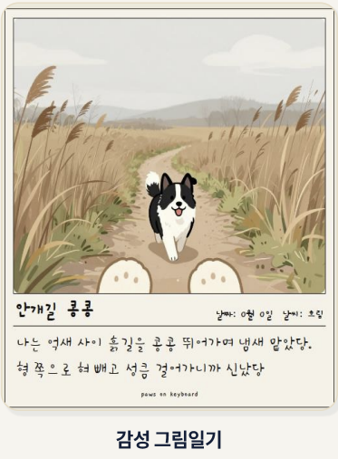
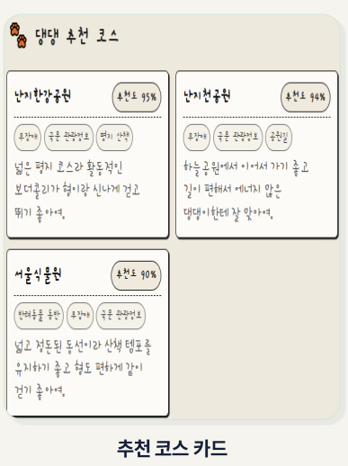

# Paws-on-Keyboard

강아지 산책 사진을 바탕으로, 단순 사진 필터가 아니라 **강아지가 직접 기억한 것 같은 그림일기**를 만드는 반려견 추억 서비스입니다.


## 핵심 흐름

```text
로그인/회원가입
-> 초기 설정: 보호자 정보, 강아지 정보, 보호자/강아지 사진 저장
-> 오늘 찍은 산책 사진 업로드
-> 장소, 날씨, 활동, 기억하고 싶은 상황 선택 입력
-> 사진 단서 + 강아지 고정 프로필 + 선택 입력으로 그림일기 생성
-> 우리집 추억에 저장
-> 우리 강아지 자랑하기 게시판에 공유
```
## 실제 화면예시



## 현재 구현

### Frontend

경로: `tour-diary-web`

- React/Vite 앱입니다.
- 로그인/회원가입, 초기 설정, 오늘 사진 생성, 추억 목록, 커뮤니티, 내 정보 화면이 있습니다.
- 백엔드 API를 우선 호출하고, 백엔드가 꺼져 있거나 외부 AI가 실패하면 로컬 SVG 그림일기 fallback을 사용합니다.
- 화면 문구는 정상 한국어로 정리되어 있습니다.
- 프로필과 추억은 로그인 사용자별 localStorage 키로 분리됩니다.
- 결과 화면의 그림은 `.drawing-image` 스타일로 컨테이너 안에 맞춰 표시합니다. 이전처럼 이미지가 칸 밖으로 잘리거나 삐져나오는 문제를 줄였습니다.
- 생성 이미지 URL은 `/uploads/...` 상대경로를 `http://localhost:8080/uploads/...`로 정규화해서 로드합니다. 이미지 로드가 실패하면 빈칸으로 두지 않고 프론트 로컬 fallback 그림으로 자동 전환합니다.
- 일기 본문은 일반 타이핑 텍스트가 아니라 글자별 회전/높낮이 차이를 주는 손글씨 느낌 렌더링을 사용합니다.
- 2026-05-25 수정: 그림일기 생성 요청에 초기 설정의 `dogPhotoUrl`을 포함합니다. 이전에는 강아지 프로필 사진을 저장해도 생성 요청에는 빠져 있어서 산책 사진만 기준으로 그림이 만들어질 수 있었습니다.
- 2026-05-25 최종 수정: 프론트 생성 흐름에서 백엔드 실패를 `catch(() => null)`로 삼키고 저품질 로컬 SVG 그림일기를 보여주던 경로를 제거했습니다. 이제 강아지 사진/산책 사진이 서버에 업로드되지 않았거나 백엔드 생성이 실패하면 실패로 알리고, 사용자에게 도형 fallback 그림을 저장하지 않습니다.

### Backend

경로: `tour-diary`

- Spring Boot 앱입니다.
- 인증, 프로필, 이미지 업로드, 산책 기록, 일기 생성, 커뮤니티, 진단 API 구조가 들어 있습니다.
- 이미지 생성은 외부 API 설정이 있으면 외부 모델을 사용하고, 실패 시 로컬 fallback으로 이어집니다.
- 로컬 이미지 fallback은 사진을 블러/픽셀화하지 않습니다. 사진 색과 장면 단서를 샘플링해 새 그림을 그립니다.
- 2026-05-25 변경: 로컬 fallback 구도를 큰 정면 강아지 캐릭터에서 강아지 시점 산책 장면으로 바꿨습니다. 산책로, 보호자 방향 하반신 단서, 리드줄, 강아지 발, 사진 기반 털색을 함께 보여줍니다.
- 2026-05-25 수정: 백엔드 이미지 생성은 산책 사진을 상황/배경 기준으로 쓰고, 초기 설정 강아지 사진을 정체성/털색/견종 기준으로 씁니다. 로컬 fallback은 강아지 사진을 우선 샘플링해 팔레트를 잡고, Gemini 이미지 생성은 산책 사진과 강아지 사진을 둘 다 입력으로 보냅니다.
- 2026-05-25 수정: Gemini/Hugging Face image-to-image가 실패해도 바로 저품질 Java 도형 fallback으로 가지 않고 Cloudflare text-to-image를 먼저 시도합니다. Cloudflare에는 긴 전체 프롬프트 대신 견종/털색/장면만 추린 짧은 전용 프롬프트를 보냅니다.
- 2026-05-25 수정: Cloudflare 토큰/크레딧이 없거나 실패해도 테스트가 가능하도록 대체 이미지 생성 경로를 추가했습니다. 순서는 `Gemini/Hugging Face image-to-image -> AI_IMAGE_GENERATE_URL 로컬/사설 이미지 서버 -> Pollinations 공개 no-token fallback -> Cloudflare text-to-image -> 최후방 로컬 PNG`입니다. 기본적으로 공개 fallback은 켜져 있고 `PUBLIC_IMAGE_FALLBACK_ENABLED=false`로 끌 수 있습니다.
- 2026-05-25 수정: 공개/Cloudflare 텍스트 이미지 생성 프롬프트를 성인용 고퀄 일러스트에서 초등학생 그림일기 스타일로 낮췄습니다. 핵심은 `full-color crayon/colored-pencil`, 거친 크레파스 선, 종이 질감, 단순 구도이며, 흑백 연필화/포토리얼/전문 일러스트는 금지합니다.
- 2026-05-25 수정: `FakeAiImageService`가 존재하지 않는 이미지 URL만 반환하던 버그를 고쳤습니다. 이제 실제 PNG 파일을 생성해 저장하므로 이미지가 빈칸으로 깨지는 상황을 줄입니다. 다만 프론트에서는 이 저품질 fallback을 정상 생성 결과로 저장하지 않습니다.
- 2026-05-25 최종 수정: 개발 중 반복 테스트를 막던 일일 생성 제한 기본값을 `0`으로 바꿨습니다. 제한이 필요하면 `APP_GENERATION_DAILY_LIMIT` 환경변수로 다시 켭니다.
- Gemini Vision 실패 시에도 업로드 이미지를 로컬로 샘플링해 흰/검흰/갈색/어두운 털, 포장 산책로, 초록 배경, 물가, 실내, 리드줄 색 단서를 추정합니다.
- 개발 확인용 `POST /api/diagnostics/vision-test`와 `POST /api/diagnostics/image-generation-test`가 있습니다.

## 실행

Frontend:

```powershell
cd tour-diary-web
npm.cmd run dev
```

Backend:

```powershell
cd tour-diary
.\gradlew.bat bootRun
```

## 확인

```powershell
cd tour-diary-web
npm.cmd run build
```

```powershell
cd tour-diary
.\gradlew.bat test
```

